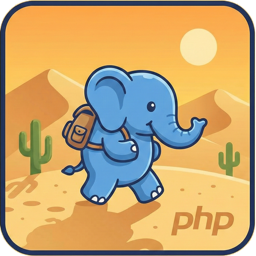

# GobiPHP

<p align="center">
  
</p>

Native macOS application to execute PHP code with syntax highlighting. Basically `php -r` with an UI

---

Warning: 100% vibe coded application

---

## Features

- Code editor with PHP syntax highlighting (keywords, variables, strings, comments, numbers)
- Execute PHP code via the "Execute" button or **Cmd+Enter** shortcut
- Result display with error highlighting in red
- Automatic PHP detection on the system
- Help message if PHP is not installed

## Requirements

- **macOS 13.0** or higher
- **Xcode 15** or higher (to compile)
- **PHP** installed on the system

### Installing PHP (if needed)

Via Homebrew:
```bash
brew install php
```

## Build and Run

1. Open the project in Xcode:
   ```bash
   open GobiPHP.xcodeproj
   ```

2. Build and run with **Cmd+R**

## Project Structure

```
GobiPHP/
├── GobiPHPApp.swift       # Application entry point
├── ContentView.swift      # User interface (editor + result)
├── PHPExecutor.swift      # PHP execution logic
├── GobiPHP.entitlements   # Application permissions
└── Assets.xcassets/       # Resources (icons, colors)
```

## Usage

1. Enter PHP code in the editor (without `<?php ?>` tags)
2. Click "Execute" or press **Cmd+Enter**
3. The result appears in the lower panel

### Example

```php
echo "Hello, World!";
```

## License

MIT
